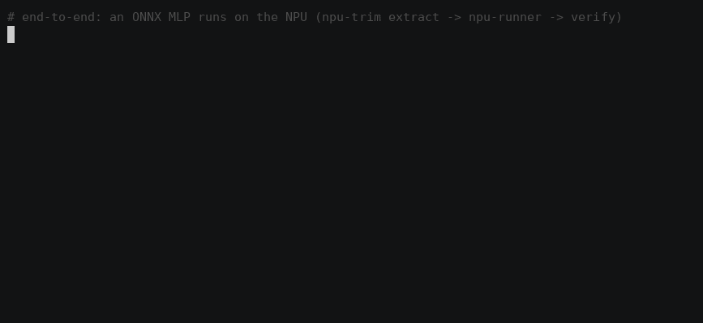
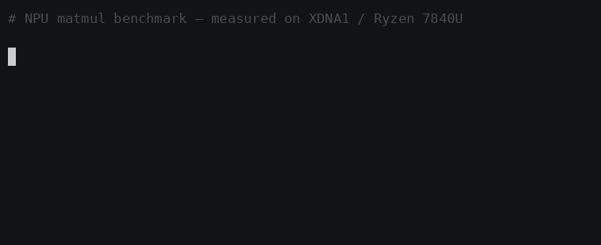
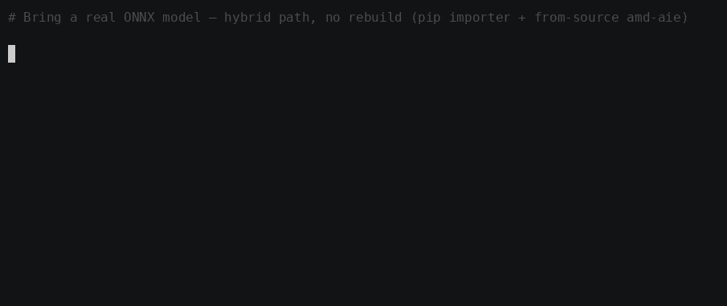
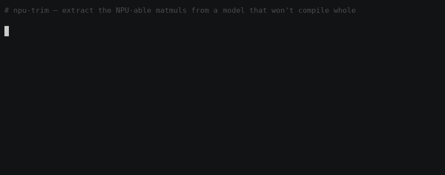

**[🇬🇧 English](README.md) · [🇩🇪 Deutsch](README.de.md) · [🇫🇷 Français](README.fr.md) · [🇰🇷 한국어](README.ko.md) · [🇯🇵 日本語](README.ja.md)**

# Ryzen AI **XDNA1** NPU 上で実際のコンピュートを **Linux** で動かす

[](LICENSE)


[](https://github.com/nod-ai/iree-amd-aie)


AMD Ryzen AI **第1世代（XDNA1 / "Phoenix"）** NPU を *ドライバからは見えているがアイドル状態* から
**実際に matmul を実行する** 状態まで持っていくための、再現可能でエンドツーエンドのレシピ — ツール付き。
[`nod-ai/iree-amd-aie`](https://github.com/nod-ai/iree-amd-aie) をソースからビルドして実現する。

> **なぜこのリポジトリが存在するのか。** 2026年の「Ryzen AI NPU がついに Linux で動く」という
> 記事のほとんどは **XDNA2**（Strix/Krackan）についてのものだ。Ryzen 7040/8040 ラップトップ
> （例: 7840U）に搭載された第1世代 **XDNA1** チップは、ターンキーなスタック群によって *明示的に除外されている* —
> AMD の Ryzen AI Software for Linux、ONNX Runtime の Vitis AI EP、Lemonade/FastFlowLM。
> XDNA1+Linux では NPU は電源が入り、in-tree の `amdxdna` ドライバによって列挙されるが、
> **出荷済みのランタイムでその上でモデルを実行できるものは存在しない。** XDNA1 を *実際に* ターゲットにできる
> 唯一のオープンな道が `iree-amd-aie` — ソースからビルドしたものだ。このリポジトリは、その道のりを
> 落とし穴ごとに検証したマップである。

## 🎬 デモ

**エンドツーエンド — NPU 上の ONNX MLP**（matmul は NPU 上で、`ReLU` は CPU 上で実行。CPU リファレンスと約 ~0.3% の差で一致）:



| | |
|:--:|:--:|
| diagnose → matmul → benchmark → Python、**NPU 上で** | 3 つの `videotestsrc` パターンに対する NPU 2D ブラー → `/dev/video10` |
|  |  |
| ウェイクワード KWS — NPU 上の 3 つの全結合層（ターゲットで発火、ノイズでは無音のまま） | bf16 は NPU 本来の強み — 最大 **220 GFLOP/s** |
|  |  |
| 実際の `.onnx` を NPU をターゲットにできる MLIR へ持っていく（ハイブリッドインポート。ソースからの amd-aie コード生成の op カバレッジが最前線） | NPU へ**実際にコンパイルできる** matmul・conv を抽出 — `npu-trim` が op を選別し、クリーンなカーネルを出力 |
|  |  |

## ✅ 動作するもの（検証済み）

**NPU 上で**（`--device=amdxdna`）コンパイル・実行し、正しい結果が得られ、再現可能なもの:

| ワークロード | 形状 | 結果 | スループット（NPU） |
|---|---|---|---|
| `i32` matmul | 128×128×128 | ✓ 完全一致 | ~3.6 ms/iter, ~280/s |
| `bf16 → f32` matmul | 256×256×256 | ✓ 完全一致（小数部含む） | ~2.9 ms/iter, ~350/s |

テストしたマシン: **Lenovo ThinkPad T16 Gen2 · Ryzen 7 PRO 7840U（Phoenix, XDNA1）
· Radeon 780M · Ubuntu 26.04 · kernel 7.0 · in-tree `amdxdna` · XRT 2.21 · NPU FW 1.5.5.391**。

## 📊 ベンチマーク

`iree-benchmark-module` による NPU 上でのエンドツーエンド計測（`--device=amdxdna`、
`npu1_4col`、10 回反復、平均）。実時間にはホスト側のディスパッチオーバーヘッドが含まれるため、
最小サイズの matmul はディスパッチ律速になる。実効コンピュートはサイズが大きくなるほど上昇する。

| dtype | 形状 (M×N×K) | time/iter | スループット | コンピュート |
|---|---|--:|--:|--:|
| `i32` | 128×128×128 | 3.58 ms | 279 it/s | 1.2 GFLOP/s |
| `i32` | 256×256×256 | 8.08 ms | 124 it/s | 4.2 GFLOP/s |
| `i32` | 512×512×512 | 43.6 ms | 23 it/s | 6.2 GFLOP/s |
| `bf16→f32` | 256×256×256 | 2.86 ms | 350 it/s | 11.7 GFLOP/s |
| `bf16→f32` | 512×512×512 | 3.90 ms | 257 it/s | 68.8 GFLOP/s |
| `bf16→f32` | 1024×1024×1024 | 9.76 ms | 102 it/s | 220 GFLOP/s |

**bf16 こそが NPU 本来の強みだ** — 1024³ で ~220 GFLOP/s に達し、なおもスケールし続ける。
一方 `i32`（AIE のネイティブ型ではない）は 6 GFLOP/s 付近で頭打ちになる。任意の行を再現するには:
`BENCH=1 ./scripts/run-matmul.sh bf16 1024 1024 1024`。


## 🚀 クイックスタート

```bash
git clone https://github.com/<you>/ryzen-npu-linux.git && cd ryzen-npu-linux

# 0. Is the NPU even alive? (read-only diagnostic)
./scripts/check-npu.sh

# 1. (if check failed on groups/memlock/xrt) activate it for your user, then re-login
./scripts/enable-npu.sh

# 2. Build iree-amd-aie from source (~65 min, 30-60 GB disk). All workarounds baked in.
./scripts/build.sh

# 3. Run a matmul ON THE NPU
./scripts/run-matmul.sh i32          # 128x128x128, all 768
./scripts/run-matmul.sh bf16         # 256x256x256 bf16->f32, all 1536
BENCH=1 ./scripts/run-matmul.sh bf16 # + benchmark
```

## 🧰 ツール

| スクリプト | 何をするか |
|---|---|
| [`scripts/check-npu.sh`](scripts/check-npu.sh) | 読み取り専用: ドライバ、デバイスノード、render グループ、memlock、XRT、pyxrt をチェックする。 |
| [`scripts/enable-npu.sh`](scripts/enable-npu.sh) | 非 root ユーザーをブロックする3つの要因（render グループ、memlock、XRT）を修正する。 |
| [`scripts/build.sh`](scripts/build.sh) | `iree-amd-aie` をクローンし、すべてのワークアラウンドを適用してビルドする。 |
| [`scripts/run-matmul.sh`](scripts/run-matmul.sh) | NPU 上で `i32`/`bf16` の matmul をコンパイル・実行する。これがレシピ。 |

## 🪤 落とし穴（素朴なビルド/実行が失敗する理由）

詳細はすべて **[docs/GOTCHAS.ja.md](docs/GOTCHAS.ja.md)** に。要点だけ:

1. **ホストコンパイラには `clang` ではなく `gcc` を使う。** clang 21 は MLIR の `BuiltinDialectBytecode.cpp` のコンパイルで *segfault* する。
2. **`-DIREE_BUILD_PYTHON_BINDINGS=OFF`。** Python バインディングは `-Werror,-Wmacro-redefined` に引っかかる。CLI ツールにはそれらは不要。
3. **Peano（`llvm-aie`）の pin を上げる。** リポジトリで pin されている nightly はインデックスから失効している。`build.sh` が最新を自動選択する。
4. **`-DIREE_ERROR_ON_MISSING_SUBMODULES=OFF`。** 3つの重いサブモジュールを意図的にスキップする。
5. **`--iree-amdaie-device-hal=amdxdna` でコンパイルする**（＋ `--iree-hal-indirect-command-buffers=false --iree-hal-memoization=false`）。さもないとディスパッチがタイムアウトする。
6. ⚠️ **`--amdxdna_n_core_cols=4` で実行する。5 ではない。** Phoenix は raw で5列を報告するが、使うのは4列（`npu1_4col`）。5 を渡す → コアがハングする → `ert state 8` でタイムアウトする。

## 🎯 実際にこれをどこで使えるのか？

対象者別（ゲーム · AI エージェント · ローカルアプリ）の実現可能性評価付き完全ガイド → [docs/APPLICATIONS.ja.md](docs/APPLICATIONS.ja.md)。

**[docs/USE-CASES.ja.md](docs/USE-CASES.ja.md)** を参照。正直に言うと: これは **カーネルレベル**
（matmul/conv のビルディングブロック）であり、ターンキーなモデルサービングではない。NPU プログラミングの学習、
ベンチマーク、特定の低消費電力推論プリミティブのビルド/オフロード、そしてオープンな XDNA1-on-Linux の取り組みへの
貢献には向いている。XDNA1 で **ドロップインの** LLM/Whisper/ONNX ランタイムが手に入るわけ **ではない** —
それは XDNA2 / Windows の領域だ。

## 📚 背景

XDNA1 と XDNA2 の比較、第1世代で Linux が難しい理由、そして `amdxdna` HAL がどのように `/dev/accel0` と
やり取りするかについては **[docs/BACKGROUND.ja.md](docs/BACKGROUND.ja.md)** を参照。

## 🧭 このリポジトリの立ち位置（そして *何ではないか*）

**これは NPU-on-Linux の最初のプロジェクトではなく、スタックのどれ一つとして発明していない** —
ドライバ、コンパイラ、ランタイムはいずれもこれより前から存在し、重い仕事を担っている:

| レイヤー | 私たちが土台とする / 隣り合う先行成果 |
|---|---|
| カーネルドライバ | [`amd/xdna-driver`](https://github.com/amd/xdna-driver) — `amdxdna`、Linux 6.14 以降メインライン、XDNA1 を `/dev/accel/accel0` として列挙する |
| コンパイラ / ランタイム | [`nod-ai/iree-amd-aie`](https://github.com/nod-ai/iree-amd-aie)、[`Xilinx/mlir-aie`](https://github.com/Xilinx/mlir-aie)（IRON）、[`Xilinx/llvm-aie`](https://github.com/Xilinx/llvm-aie)（Peano）、[`amd/Triton-XDNA`](https://github.com/amd/Triton-XDNA) — `npu1` 向けにコンパイルする SDK / フレームワーク |
| 先行する XDNA1 + Linux コンピュート | 研究論文（[arXiv 2504.03083](https://arxiv.org/abs/2504.03083) — IRON 経由で Phoenix 7940HS 上で GPT-2）、プリミティブのみのチュートリアル、[Gentoo wiki の XDNA 解説](https://wiki.gentoo.org/wiki/User:Lockal/AMDXDNA) |
| Linux でのターンキー NPU LLM | FastFlowLM · Lemonade 10.x · AMD Ryzen AI SW — **すべて XDNA2 専用であり、XDNA1 を明示的に除外している** |

したがって「Linux 初の NPU」「初のコンパイラ」「XDNA1 を初めて動かした」と言えば、いずれも
過大な主張になる — 私たちはそうした主張をしない。

**このリポジトリが *何であるか*:** 公開情報の検索（2026-06）で見つかる限り、**第1世代の XDNA1
（Phoenix、例: 7840U）NPU を Linux 上で** 動かして *任意の実コンピュート*（`i32`/`bf16` の matmul、conv）
を走らせる、最初にして唯一の **パッケージ化された、再現可能な、エンドツーエンドのレシピ + ツールキット** だ
— あらゆるターンキーなベンダースタックが取り残したまさにそのハードウェア / OS の組み合わせである。先行成果は、
アップストリームの **SDK / フレームワーク**（ソースからのつまずきは自分で乗り越える）、**XDNA2 専用** のアプリ、
**研究論文**（クリックして実行できるリポジトリはない）、あるいは **Windows 専用** のコンピュート経路のいずれかだ。
際立っているのはその *バンドル* である: diagnose→enable→build→run のスクリプト群、ソースからの
**落とし穴マップ**、**永続的な C-API/ctypes ランナー**（呼び出しごとの `iree-run-module` より ~11× 速い）、
**アプリ例**（ウェイクワード、NPU カメラデーモン）、**正直に実現可能性を評価したアプリケーションガイド**
（計測値「音声では NPU が CPU に負ける」を含む）、そして 5 言語のドキュメント。

> **正直な但し書き:** この立ち位置は README とスニペットの公開検索によるものだ
> （外部リポジトリをクローン / 検証したわけではない）。プライベートリポジトリ、企業内の作業、あるいは
> 使い捨てスクリプトのロングテールは **見えない** — 「直接の同類は見つからなかった」とは
> まさにそういう意味であって、「存在しない」という意味ではない。

## ⚖️ 免責事項

これはコミュニティのノートであり、AMD/Xilinx の製品ではない。`iree-amd-aie` は初期フェーズで
変化が速く、バージョンやフラグはドリフトする。ここに書かれたものはすべて、上記のとおりの正確なマシン上で
2026-06-22 に検証した。他の XDNA1 ラップトップでの結果を伴う Issue/PR を歓迎する。

## 🤝 コントリビュート

最も有用な貢献は、**あなた自身の XDNA1 マシンでの結果** だ — 第1世代の
Linux 上 Ryzen AI に関する情報は乏しい。**[CONTRIBUTING.md](CONTRIBUTING.md)** を参照。要点だけ:

- **ハードウェアの結果を報告する** — あなたのチップ／カーネル／ディストロと、何が動いて何が失敗したか（Issue テンプレートを用意している）。
- 他の形状／dtype 向けの **ベンチマークを追加する**、あるいは **新しい op**（conv、i8、…）を追加する。
- **[落とし穴](docs/GOTCHAS.ja.md)** を修正・改良する、スクリプトを堅牢にする、または翻訳を追加・修正する。
- Fork → branch → test with `scripts/run-matmul.sh` → PR describing what you ran it on.

## 📄 ライセンス

**[MIT](LICENSE)** © 2026 Jonas-Augustinus-Linus — 使って、フォークして、出荷してくれ。

このリポジトリのスクリプトとドキュメントは MIT だ。これらは、それぞれ独自のライセンスの下にある
サードパーティのプロジェクト — IREE と `iree-amd-aie`（Apache-2.0 WITH
LLVM-exception）、`Xilinx/llvm-aie`（Peano） — をビルドし駆動するものであり、このリポジトリはそれらを再配布しない。
