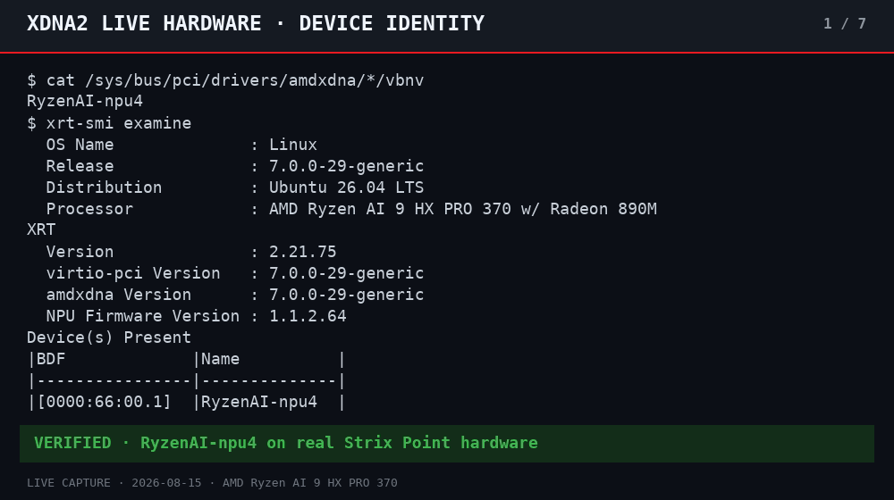
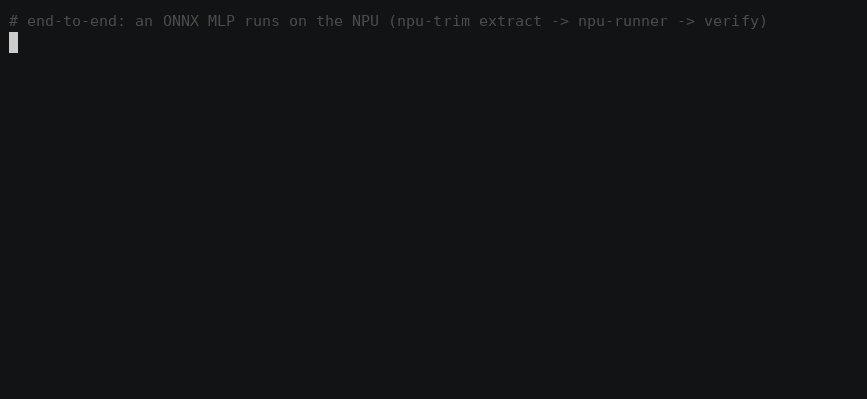
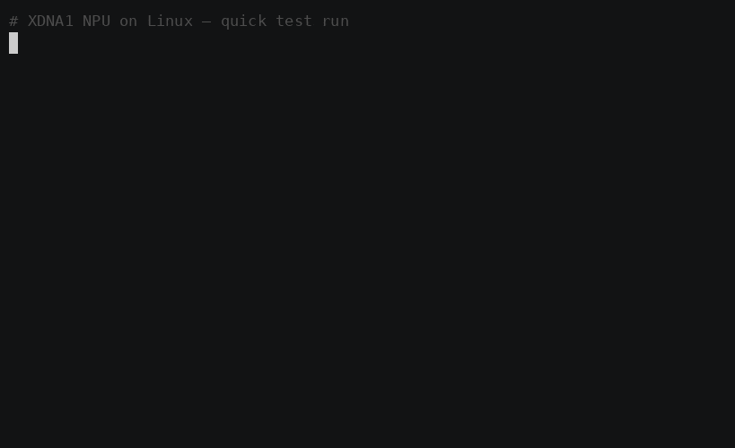
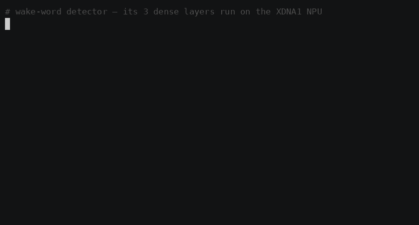
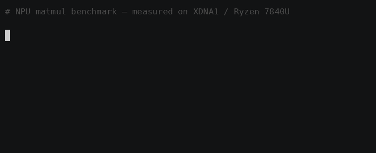
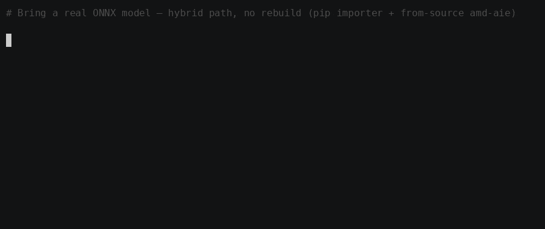
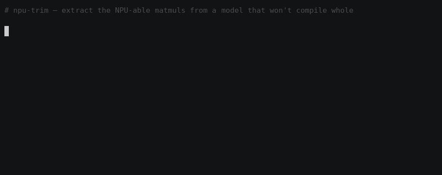

**[🇬🇧 English](README.md) · [🇩🇪 Deutsch](README.de.md) · [🇫🇷 Français](README.fr.md) · [🇰🇷 한국어](README.ko.md) · [🇯🇵 日本語](README.ja.md)**

# **Linux**에서 여는 Ryzen AI **XDNA1 + XDNA2** NPU 연산

[](LICENSE)
[](https://github.com/Jonas-Augustinus-Linus/ryzen-npu-linux/releases)


[](https://github.com/nod-ai/iree-amd-aie)


*드라이버에는 보이지만 놀고 있는* NPU를 Linux에서 실제로 연산하고 CPU
기준값까지 확인하는 상태로 만드는 공개·재현 가능 경로다. 기존 XDNA1/Phoenix
소스 빌드 경로를 보존하면서, 같은 탐지 → 빌드 → 검증 → 지속형 runner 계약을
Strix Point XDNA2(`RyzenAI-npu4`)까지 완성했다.

> **이 저장소가 존재하는 이유.** 7840U를 포함한 Ryzen 7040/8040 노트북의
> 1세대 **XDNA1**은 드라이버에는 보이면서도 현재 Linux 턴키 제품에서는 놀고
> 있을 수 있다. 2026-08-15 현재 AMD 공식 Linux 지원 페이지는 STX/KRK를
> 열거하며 Phoenix는 포함하지 않는다.[^amd-linux-support] 이 제품 지원 경계가
> 장치를 쓸모없게 만들지는 않는다. 이제 공개된 저수준 경로는 **두 개**다. 이
> 저장소가 고정·패키징한 재현 가능한 IREE 경로 `iree-amd-aie`, 그리고 IRON
> Python API/컴파일러 트랙을 이 저장소가 1.4.1에 고정한 직접 커널 스택
> [`Xilinx/mlir-aie`](https://github.com/Xilinx/mlir-aie)다. 더 새로운 연산자·
> 애플리케이션 라이브러리 [`amd/IRON`](https://github.com/amd/IRON)은
> **MLIR-AIE 언어 바인딩 위에 구축된 별도 프로젝트**이며 `Xilinx/mlir-aie`의
> 이름 변경이 아니다. 이 저장소는 CPU로 대조한 경로와 명시적인 근거 경계를
> 제공할 뿐, 턴키 whole-model server를 완성했다고 주장하지 않는다.

> 🆕 **XDNA2 Strix Point(`RyzenAI-npu4`) 사용자라면?** 2세대에서 지형이 뒤집혔다: Linux에서
> 턴키 LLM 추론이 이제 존재하고(FastFlowLM/Lemonade), Ubuntu 26.04는 XRT
> 유저스페이스를 기본 패키지로 제공하며 — 이 저장소의 활성화 도구는 거기서
> **무수정으로** 동작한다(Ryzen AI 9 HX PRO 370에서 검증). **연산도 마찬가지다**:
> mlir-aie/IRON 트랙이 Strix의 8개 컬럼 전부에서 돌아간다 — 6.65 TOPS i8 GEMM,
> 전체 MobileNet, 그리고 8.0× 컬럼 스케일링을 보여주는 우리의 커스텀 커널
> ([docs/MLIR-AIE.ko.md](docs/MLIR-AIE.ko.md)). 무엇이 이식되고, 무엇이 바뀌었으며,
> 열린 최전선이 어디로 옮겨갔는지: **[docs/XDNA2.ko.md](docs/XDNA2.ko.md)**.
> 이후 `npu5`/`npu6` 장치는 임의로 같은 타깃에 매핑하거나 지원한다고 주장하지
> 않는다. 정확한 범위는 [지원 표](docs/SUPPORT.md)에 공개한다.

## 🌱 우리가 이 작업을 무료로 나누는 이유

한 대의 컴퓨터에서 PASS를 보는 것이 이 작업의 끝은 아니다. 이 저장소를 MIT
라이선스로 누구에게나 무료로 공개하는 까닭은 Linux 사용자가 모든 계층을 직접
살펴보고, 같은 결과를 재현하고, 커널을 바꾸고, 다시 공동체에 개선을 돌려줄 수
있게 하기 위해서다. 학생, 독립 개발자, 연구자, 작은 팀들이 이 토대 위에서
**서로 다른 수많은 LLM과 로컬 AI**를 만들기를 바란다. 사적인 오프라인 에이전트,
접근성 도구, 다국어 모델, 저전력 상시 서비스, 새로운 양자화 방식, 그리고 우리가
아직 상상하지 못한 응용까지 이어지기를 바란다.

**MIT 라이선스 조건에 따라 누구나 이 작업을 사용·복사·수정·포크·공개·재배포·
재라이선스하고, 교육이나 상업적 용도로 활용할 수 있다.** 라이선스가 요구하는
저작권 및 라이선스 고지는 유지해야 하며, 서드파티 코드와 모델 자산은 각자의
라이선스를 따른다. 별도 허락은 필요 없고, 개선 사항을 돌려주는 것은 환영하지만
의무가 아니다.

아직 임의의 LLM이 전부 NPU에서 곧바로 실행된다고 주장하는 것은 아니다. 대신
그 미래에 필요한 바닥을 구체적으로 완성한다. 엄격한 장치 탐지, 고정된 빌드,
CPU 기준 정확도, 지속형 C/Python 호출, 실제 예제, 실패 경계까지 모두 공개한다.
성공의 기준은 하나의 모델을 소유하는 것이 아니라, 더 많은 사람이 이 위에서
자신의 것을 만들 수 있게 되는 것이다. [Open NPU Lab](docs/OPEN-NPU-LAB.ko.md)에서
출발하고, 모든 주장을 1차 자료로 잇는 [연구 원장](docs/RESEARCH.md)을 살핀 뒤,
[공개 LLM 로드맵](docs/LLM-ROADMAP.md)이나 [기여 안내](CONTRIBUTING.md)에서
다음 목표를 골라주길 바란다.

## 🎬 데모

### XDNA2 / Strix Point — 실제 하드웨어

IREE `npu4` i32·bf16 matmul은 CPU 참조값과 정확히 일치하고, 상주형
runner는 16,384개 출력 전체를 검증하며, 커스텀 IRON 커널은 XRT와
HRX 모두에서 8개 컬럼 전체로 PASS한다:



### XDNA1 / Phoenix — 기존 실기 검증 데모

**하이브리드 경로의 구조 — 생성된 ONNX MLP** (matmul은 NPU에서, `ReLU`는
CPU에서 실행; 학습 앱이 아닌 생성 weight이며 CPU 레퍼런스와 ~0.3% 이내로 일치):



| | |
|:--:|:--:|
| diagnose → matmul → benchmark → Python, **NPU에서 실행** | 세 가지 `videotestsrc` 패턴에 비-AI NPU 2D box blur 적용 → `/dev/video10` |
|  |  |
| 웨이크워드 경로 — **예시용 미학습 weight**로 NPU dense 레이어 3개 | bf16은 NPU의 고유 강점 — 최대 **220 GFLOP/s** |
|  |  |
| 실제 `.onnx`를 NPU 타깃 가능한 MLIR로 가져오기 (하이브리드 임포트; 소스에서 빌드한 amd-aie 코드젠의 op 커버리지가 최전선이다) | NPU로 **실제** 컴파일되는 matmul·conv 추출 — `npu-trim`이 op를 선별하고 깔끔한 커널을 내보낸다 |
|  |  |

## ✅ 동작하는 것 (검증됨)

**NPU에서** 컴파일·실행되었고(`--device=amdxdna`), 결과가 정확하며, 재현 가능함:

| 워크로드 | Shape | 결과 | 처리량 (NPU) |
|---|---|---|---|
| `i32` matmul | 128×128×128 | ✓ 정확 | ~3.6 ms/iter, ~280/s |
| `bf16 → f32` matmul | 256×256×256 | ✓ 정확 (소수부 포함) | ~2.9 ms/iter, ~350/s |

테스트 머신: **Lenovo ThinkPad T16 Gen2 · Ryzen 7 PRO 7840U (Phoenix, XDNA1)
· Radeon 780M · Ubuntu 26.04 · kernel 7.0 · 인트리 `amdxdna` · XRT 2.21 · NPU FW 1.5.5.391**.
이 XDNA1 측정값은 과거 당시 nightly의 기록이다. Strix에서 다시 검증한 현재 v1
정확 핀으로는 아직 재측정하지 않았다.

## 📊 벤치마크

`iree-benchmark-module`로 NPU에서 측정한 엔드투엔드 결과(`--device=amdxdna`,
`npu1_4col`, 10회 반복, 평균). 벽시계 시간(wall-clock)에는 호스트 디스패치 오버헤드가
포함되어 있어, 가장 작은 matmul은 디스패치에 묶인다(dispatch-bound). 실효 연산량은
크기가 커질수록 올라간다.

| dtype | Shape (M×N×K) | 시간/iter | 처리량 | 연산량 |
|---|---|--:|--:|--:|
| `i32` | 128×128×128 | 3.58 ms | 279 it/s | 1.2 GFLOP/s |
| `i32` | 256×256×256 | 8.08 ms | 124 it/s | 4.2 GFLOP/s |
| `i32` | 512×512×512 | 43.6 ms | 23 it/s | 6.2 GFLOP/s |
| `bf16→f32` | 256×256×256 | 2.86 ms | 350 it/s | 11.7 GFLOP/s |
| `bf16→f32` | 512×512×512 | 3.90 ms | 257 it/s | 68.8 GFLOP/s |
| `bf16→f32` | 1024×1024×1024 | 9.76 ms | 102 it/s | 220 GFLOP/s |

**bf16은 NPU의 본래 강점이다** — 1024³에서 ~220 GFLOP/s이며 여전히 스케일링 중인 반면,
(AIE의 네이티브 타입이 아닌) `i32`는 6 GFLOP/s 근처에서 한계에 부딪힌다. 어떤 행이든 재현하려면:
`BENCH=1 ./scripts/run-matmul.sh bf16 1024 1024 1024`.


## 🚀 Quickstart

```bash
git clone https://github.com/Jonas-Augustinus-Linus/ryzen-npu-linux.git
cd ryzen-npu-linux

# 호스트/디스크/sudo 요구사항을 읽고 엄격한 읽기 전용 점검을 실행한다.
less docs/SUPPORT.md
./scripts/check-npu.sh --strict

# 그룹/memlock/XRT 실패가 있을 때만 내용을 검토하고 실행한 뒤 한 번 재부팅한다.
./scripts/enable-npu.sh

# versions.lock에 고정된 IREE/Peano 도구 체인을 소스에서 빌드한다. 이 단계는
# --full의 native IRON 호스트 검사에 필요한 libxrt-dev도 설치한다.
./scripts/build.sh

# 공개 인수 계약: 장치 탐지 -> CPU 기준 비교 -> native/Python runner.
./scripts/verify-stack.sh --quick

# 선택: 별도로 고정된 IRON 스택을 설정한 뒤 모든 항목을 검증한다.
./scripts/setup-mlir-aie.sh
./scripts/verify-stack.sh --full
```

## 🧰 도구

| 스크립트 | 하는 일 |
|---|---|
| [`scripts/check-npu.sh`](scripts/check-npu.sh) | 읽기 전용: 드라이버, 디바이스 노드, render 그룹, memlock, XRT, pyxrt를 점검한다. |
| [`scripts/enable-npu.sh`](scripts/enable-npu.sh) | 비루트 사용자를 막는 3가지(render 그룹, memlock, XRT)를 바로잡는다. |
| [`scripts/detect-npu.sh`](scripts/detect-npu.sh) | 검증된 VBNV/지오메트리만 `npu1_4col` 또는 `npu4`로 매핑하고 미확인 장치는 거부한다. |
| [`scripts/build.sh`](scripts/build.sh) | `versions.lock`에 고정된 IREE/Peano 소스 스택을 빌드한다. |
| [`scripts/run-matmul.sh`](scripts/run-matmul.sh) | `i32`/`bf16` matmul을 컴파일·실행하고 모든 출력을 CPU와 비교한다. |
| [`scripts/verify-stack.sh`](scripts/verify-stack.sh) | CLI, native/Python runner, 선택 앱/IRON을 아우르는 엄격한 실기 인수 테스트다. |
| [`scripts/validate-repo.sh`](scripts/validate-repo.sh) | 하드웨어 없이 로컬/CI에서 실행하는 릴리스 검사다. |

## 🔬 예제와 도구

- [`tools/npu-trim/`](tools/npu-trim/) — 가져온 그래프를 선별하고, 감지된
  타깃에 컴파일되는 matmul/conv만 추출한다. 임의 ONNX 런타임은 아니다.
- [`tools/npu-runner/`](tools/npu-runner/) — VMFB를 한 번 load하고 C와
  Python/ctypes에서 지속적으로 호출한다.
- [`examples/local-rag-sidecar/`](examples/local-rag-sidecar/) — **실제 RAG
  루프 안에 NPU가 들어가는 통합 예제**: CPU chunk/hash → 지속형 NPU score
  matrix → CPU top-k → 선택적 로컬 LLM. feature는 학습된 embedding이 아니며,
  작은 질의 하나는 CPU가 더 빠를 가능성이 크다. 현재 핀 XDNA1 실기 검증은
  남아 있고 현재 live 근거는 XDNA2다.
- [`examples/wake-word/`](examples/wake-word/) — 예시용 matched-filter weight로
  지속형 NPU dense layer 세 개를 실행한다. **학습된 wake vocabulary가 아니다**.
- [`examples/onnx-mlp/`](examples/onnx-mlp/) — **생성된** 모델의 실제 하이브리드
  forward: NPU matmul 두 개, 명시적 CPU ReLU, CPU 기준 대조.
- [`examples/npu-camera/`](examples/npu-camera/) — 실제 GStreamer → NPU →
  `v4l2loopback` 배관이지만 현재 NPU 연산은 **비-AI box blur**다.

## 🧩 두 번째 경로: `mlir-aie` (IRON)

`iree-amd-aie`(위)는 지원되는 IREE 그래프를 컴파일한다.
[`Xilinx/mlir-aie`](https://github.com/Xilinx/mlir-aie)는 이 저장소가 1.4.1에
고정한 저수준 스택이다. 그 IRON Python API/컴파일러 경로에서 **NPU 커널을
직접 작성**하고 `pyxrt`로 실행하며, 실제 ML
`programming_examples`를 함께 제공한다. **두 세대 모두**의 실기 근거가 있지만
같은 의존성 스냅샷으로 검증된 것은 아니다. Phoenix/`npu1` 결과는 과거 당시의
기록이고, v1 정확 핀은 Strix/`npu2`에서 다시 검증했다(자동 감지). 현재 핀으로
실행한 XDNA1 보고를 환영한다. 설정 과정은 iree-amd-aie Peano의
정확한 `llvm-aie` 버전과 **clang 빌드 커밋**이 해당 mlir-aie 릴리스의
`utils/peano-requirements.txt` 핀과 모두 일치할 때만 이를 재사용하며, 그렇지
않으면 mlir-aie venv에 그 핀 버전 wheel을 설치한다. 전체 가이드 →
**[docs/MLIR-AIE.ko.md](docs/MLIR-AIE.ko.md)**.

[`amd/IRON`](https://github.com/amd/IRON)은 MLIR-AIE 언어 바인딩 위에 구축된
별도의 최신 연산자·애플리케이션 라이브러리다. `Xilinx/mlir-aie`의 이름 변경이나
새 저장소 위치가 아니다. 이 움직이는 라이브러리는 이 릴리스가 고정한 직접 커널
트랙보다 훨씬 넓다. 정확한 커밋
[`cdc48e93`](https://github.com/amd/IRON/tree/cdc48e93)에서 AMD 공식 Phoenix
workflow는 **pytest case-run 2,105개 통과, 45개 건너뜀**을 보고했다. 기본
5회 iterations를 고려하면 **서로 다른 통과 구성
421개와 서로 다른 skip 구성 9개**다. 2,105개의 서로 다른 테스트가 아니다.
9개 skip은 MHA 3개, streaming-SwiGLU 3개, GEMV+GELU 3개 구성이고 각각 5회
반복됐다.[^iron-phoenix-ci] 통과한 CPU 기준 AIE2 범위에는 GEMM/GEMV, Q4NX
역양자화, softmax, RoPE, RMSNorm/LayerNorm, activation, transpose가 포함된다.
이는 업스트림 Phoenix 근거이지 이 저장소의 현재 핀 XDNA1 재실행이나 전체
LLM이 아니다. GQA는 이 Phoenix run으로 입증되지 않았다.

```bash
./scripts/setup-mlir-aie.sh                 # mlir_aie wheel + py3.14 venv + compatible Peano
./scripts/run-mlir-example.sh ml/conv2d     # build for the detected NPU + run ON IT (pyxrt)
./examples/mlir-aie/relu_add/run.sh         # a custom hand-written fused kernel
```

**NPU에서** 검증됨(XDNA1, `run_py` / `pyxrt`, 출력은 torch/numpy 골든값과 대조):

| 예제 | 종류 | NPU 시간 |
|---|---|--:|
| `basic/passthrough_kernel` | DMA 패스스루 | ✓ |
| `basic/vector_scalar_mul` | 벡터 × 스칼라 | ✓ |
| `ml/conv2d` | INT8 3×3 conv | ~0.9 ms |
| `ml/conv2d_fused_relu` | conv + ReLU 융합 | ~0.8 ms |
| `ml/bottleneck` | ResNet bottleneck 블록 | ~2.8 ms |
| `ml/resnet/layers_conv2_x` | ResNet conv2_x 레이어 | ~5.1 ms |
| `ml/magika` | Google의 파일 유형 모델 (bf16) | ~0.9 ms |
| [`examples/mlir-aie/relu_add`](examples/mlir-aie/relu_add/) | **커스텀** 융합 `relu(a+b)` 커널 | ~0.37 ms |

**XDNA2**(Strix Point, 8 컬럼 / 32 타일, mlir-aie 1.4.1)에서는: 어레이 전체
(whole-array) GEMM이 **6.65 TOPS**(i8) / **4.64 TFLOPS**(bfp16 경유 bf16)를
찍고, LLM 블록들(softmax/RoPE/SwiGLU/RMSNorm)이 통과하며, **전체
`ml/mobilenet`이 돌아가고**(~176 ms — Phoenix의 4 컬럼에서는 *돌 수 없는*
설계다), 우리의 커스텀 커널은 컬럼 전반에 걸쳐 **8.0×**로 스케일된다. XDNA2
표들과 커널 직접 작성 워크스루는
**[docs/MLIR-AIE.ko.md](docs/MLIR-AIE.ko.md)**에 있다.

## 🪤 Gotcha들 (순진하게 빌드/실행하면 왜 실패하는가)

자세한 내용은 **[docs/GOTCHAS.ko.md](docs/GOTCHAS.ko.md)**에 있다. 요약 목록:

1. **호스트 컴파일러로 `clang`이 아니라 `gcc`를 써라.** clang 21은 MLIR `BuiltinDialectBytecode.cpp`를 컴파일할 때 *세그폴트*가 난다.
2. **`-DIREE_BUILD_PYTHON_BINDINGS=OFF`.** Python 바인딩은 `-Werror,-Wmacro-redefined`에 걸린다. CLI 도구에는 필요 없다.
3. **고정된 Peano(`llvm-aie`)를 사용하라.** `build.sh`는 `versions.lock`의 정확한 핀을 설치·검증하며, 더 최신 nightly를 몰래 선택하는 대신 실패한다.
4. **`-DIREE_ERROR_ON_MISSING_SUBMODULES=OFF`.** 무거운 서브모듈 3개를 의도적으로 건너뛴다.
5. **`--iree-amdaie-device-hal=amdxdna`로 컴파일하라**(+ `--iree-hal-indirect-command-buffers=false --iree-hal-memoization=false`). 그러지 않으면 디스패치가 타임아웃 난다.
6. ⚠️ **`--amdxdna_n_core_cols=4`로 실행하라, 5가 아니다.** Phoenix는 raw 컬럼을 5개로 보고하지만 실제로는 4개를 쓴다(`npu1_4col`). 5를 넘기면 → 코어가 hang → `ert state 8` 타임아웃.

## 🎯 실제로 어디에 쓸 수 있나?

대상별 전체 가이드(게임 · AI 에이전트 · 로컬 앱)와 실현성 등급 → [docs/APPLICATIONS.ko.md](docs/APPLICATIONS.ko.md).

**[docs/USE-CASES.ko.md](docs/USE-CASES.ko.md)**를 보라. 하이브리드 로컬 AI
실험실을 만들 수 있다. NPU는 반복 점수 계산·상시 단계·검증된 dense/conv 블록,
CPU는 I/O·정책·fallback, iGPU는 필요할 때 token 생성을 맡는다.
[local RAG sidecar](examples/local-rag-sidecar/)가 이 분할을 소스로 보여준다.
XDNA1에서 임의 모델 전체를 처리하는 drop-in server는 여전히 없으며, 에너지
효율도 이미 증명한 성과가 아니라 측정해야 할 목표다.

## 📚 배경

XDNA1 vs XDNA2, 1세대에서 Linux가 왜 어려운지, 그리고 `amdxdna` HAL이 `/dev/accel0`와 어떻게
통신하는지는 **[docs/BACKGROUND.ko.md](docs/BACKGROUND.ko.md)**를 보라.

## 🧭 이 저장소의 위치 (그리고 *아닌* 것)

**이것은 Linux에서 NPU를 다룬 최초의 프로젝트가 아니며, 스택의 어느 부분도 새로 발명하지 않았다** —
드라이버, 컴파일러, 런타임 모두 이 저장소보다 먼저 존재했고 무거운 일을 다 해낸다:

| 계층 | 우리가 그 위에 올라타거나 곁에 두는 선행 작업 |
|---|---|
| 커널 드라이버 | [`amd/xdna-driver`](https://github.com/amd/xdna-driver) — `amdxdna`, Linux 6.14부터 메인라인에 포함, XDNA1을 `/dev/accel/accel0`로 enumerate 한다 |
| 컴파일러 / 런타임 | [`nod-ai/iree-amd-aie`](https://github.com/nod-ai/iree-amd-aie), [`Xilinx/mlir-aie`](https://github.com/Xilinx/mlir-aie) (고정된 1.4.1 IRON Python API/컴파일러 스택), [`Xilinx/llvm-aie`](https://github.com/Xilinx/llvm-aie) (Peano), [`amd/Triton-XDNA`](https://github.com/amd/Triton-XDNA) — XDNA 세대를 타깃하는 업스트림 SDK/프레임워크 |
| 최신 연산자 / 애플리케이션 라이브러리 | [`amd/IRON`](https://github.com/amd/IRON) — MLIR-AIE 언어 바인딩 위의 별도 프로젝트이며, `Xilinx/mlir-aie`의 이름 변경이나 새 위치가 아님 |
| 선행 XDNA1 + Linux 연산 | 연구 논문 한 편([arXiv 2504.03083](https://arxiv.org/abs/2504.03083) — IRON으로 Phoenix 7940HS에서 돌린 GPT-2), 프리미티브 전용 튜토리얼들, [Gentoo wiki XDNA 정리글](https://wiki.gentoo.org/wiki/User:Lockal/AMDXDNA) |
| Linux용 턴키 NPU LLM | [`FastFlowLM`](https://github.com/ROCm/FastFlowLM)과 [`Lemonade`](https://github.com/lemonade-sdk/lemonade/blob/main/docs/guide/faq.md)의 NPU 경로는 XDNA2를 명시적으로 요구한다. AMD Ryzen AI Software 1.8 for Linux는 STX/KRK만 열거하며 Phoenix XDNA1은 포함하지 않는다 |

따라서 "Linux 최초의 NPU", "최초의 컴파일러", "XDNA1을 최초로 구동" 같은 표현은 전부
과장이 될 것이고 — 우리는 그렇게 주장하지 않는다.

**이 저장소가 *무엇인가 하면*:** **패키징되고 재현 가능한 엔드투엔드
레시피 + 도구 모음**이다. 턴키 스택이 외면한 XDNA1/Phoenix에서 실제 연산을
가능하게 하는 일로 시작해, 이제 Strix Point npu4에도 같은 공개 정확도 계약을
제공한다. 선행 작업은
업스트림 **SDK/프레임워크**(소스에서 빌드할 때의 함정은 직접 헤쳐나가야 함)이거나, **XDNA2 전용**
앱이거나, **연구 논문**(클릭해서 바로 돌릴 수 있는 저장소가 없음)이거나, **Windows 전용** 연산
경로다. 차별점은 바로 그 *묶음*에 있다: diagnose→enable→build→run 스크립트, 소스 빌드의
**gotcha 지도**, **상주(persistent) C-API/ctypes 러너**(호출마다 `iree-run-module`을 부르는 것보다
~11× 빠름), **앱 예제들**(웨이크워드, NPU 카메라 데몬), **솔직한 실현성 등급 애플리케이션 가이드**
(측정으로 드러난 "오디오에서는 NPU가 CPU에 진다"는 사실 포함), 그리고 5개 언어 문서.

> **솔직한 단서:** 생태계는 빠르게 바뀌며 비공개·기업 내부 작업은 보이지 않는다.
> 새로 인용하거나 비교해야 할 프로젝트와 결과가 있다면 이슈로 알려주길 바란다.
> 더 정확한 공동 지도가 생태계 모두에게 도움이 된다.

## ⚖️ 면책 조항

이것은 AMD/Xilinx 제품이 아니라 커뮤니티 노트다. `iree-amd-aie`는 초기 단계이며 빠르게
바뀐다. 버전/플래그가 변동된다. 실기 근거는 날짜와 핀에 종속된다. XDNA1/Phoenix
결과는 과거 당시 nightly의 기록이고, v1 정확 핀은 2026-08-15까지 Strix Point
XDNA2에서 다시 검증했다. Hawk Point 결과는 아직 없다. 현재 핀의 XDNA1 결과와
다른 XDNA1/XDNA2 결과를 정확한 장치 식별값 및 검증 로그와 함께 보내주길 바란다.

## 🤝 기여하기

가장 쓸모 있는 기여는 **여러분 자신의 XDNA1 또는 XDNA2 머신에서 나온 재현 가능한
결과**다. **[CONTRIBUTING.md](CONTRIBUTING.md)**를 보라. 요약하면:

- **하드웨어 결과를 보고하라** — 여러분의 칩 / 커널 / 배포판과 무엇이 동작했고 무엇이 실패했는지(이슈 템플릿 제공).
- 다른 shape/dtype에 대한 **벤치마크를 추가**하거나, **새 op**(conv, i8, …)를 추가하라.
- **[gotcha](docs/GOTCHAS.ko.md)를 고치거나 다듬고**, 스크립트를 견고하게 하거나, 번역을 추가/수정하라.
- Fork → branch → `scripts/validate-repo.sh`, 실기 변경이면
  `scripts/verify-stack.sh --quick` → 정확한 실행 내용을 담은 PR.

## 📄 라이선스

**[MIT](LICENSE)** © 2026 Jonas-Augustinus-Linus — 사용하고, 복사하고,
수정하고, 포크하고, 공개하고, 재배포하고, 교육하고, 상업적으로 활용하라.
라이선스가 요구하는 저작권 및 라이선스 고지는 보존해야 한다.

이 저장소의 스크립트와 문서는 MIT다. 이들은 각자의 라이선스를 따르는 서드파티
프로젝트 — IREE와 `iree-amd-aie`(Apache-2.0 WITH LLVM-exception), `Xilinx/llvm-aie`(Peano) —
를 빌드하고 구동하며, 이 저장소는 그것들을 재배포하지 않는다.

[^amd-linux-support]: AMD, [Ryzen AI Software 1.8 for Linux](https://ryzenai.docs.amd.com/en/latest/linux.html), 2026-08-15 확인.
[^iron-phoenix-ci]: AMD IRON, [공식 Phoenix workflow run 31876069460](https://github.com/amd/IRON/actions/runs/31876069460), 커밋 `cdc48e93`.
