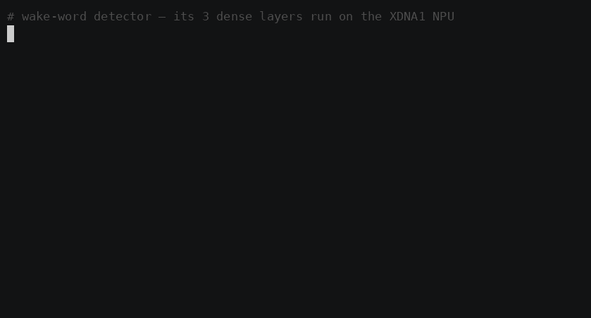

# Wake-word detector — dense layers on the XDNA1 NPU



A runnable **template** for an always-on keyword spotter whose fully-connected
layers execute **on the Ryzen AI XDNA1 NPU** under Linux. Wake-word / KWS is the
single best agent-side fit for this NPU (tiny, runs forever, perf-per-watt is the
whole point — see [`../../docs/APPLICATIONS.md`](../../docs/APPLICATIONS.md)).

```
audio ─▶ log-mel features ─▶ Dense(W1)─ReLU ─ Dense(W2)─ReLU ─ Dense(W3) ─▶ score ─▶ threshold ─▶ "wake!"
         └───── CPU ─────┘    └─NPU─┘ └CPU┘   └─NPU─┘ └CPU┘   └─NPU─┘       └──────── CPU ────────┘
```

Each `Dense` layer is one **128×128×128 i32 matmul dispatched to the NPU** via
`iree-run-module --device=amdxdna` (npy file I/O). ReLU and a fixed-point requant
shift run on the CPU — the classic split this hardware rewards: **dense math on
the NPU, glue on the CPU.**

## Run it

```bash
# from the repo root you must have built iree-amd-aie first (../../scripts/build.sh)
cd examples/wake-word
./run.sh --selftest            # compiles dense_npu.mlir, runs the NPU pipeline
```

Expected (the 3 `[NPU] Dense …` lines are real NPU dispatches):

```
  → wake word    peak score =     94   (score)
  → background   peak score =     28   (score)

RESULT: ✅ clear separation (wake 94 ≫ noise 28) — the 3-dispatch NPU MLP works.
        Pick a threshold around 61:  ./run.sh --wav your.wav --threshold 61
```

Score a real recording (16 kHz mono WAV):

```bash
./run.sh --wav your.wav --threshold 61
```

## What's real here, and what isn't

**Real:** the three matmuls genuinely run on the NPU (kill the device and it
errors; the math is verified — same `i32` matmul as [`../matmul_i32.mlir`](../matmul_i32.mlir)).
The log-mel front-end is a real (numpy-only) STFT→mel→log pipeline.

**Illustrative:** the **weights are not trained.** `--selftest` builds a
*matched filter* — a zero-mean template of the synthetic wake tone placed in `W1`,
with `W2`/`W3` as identity. Zero-mean is the trick that makes it work: a flat,
featureless spectrum (white noise after min-max quant) dots to ≈0 and ReLU kills
it, while the peaky wake spectrum dots to a large positive score. It proves the
**pipeline**, not a real vocabulary.

## Make it detect *your* wake word

The NPU path never changes — only the weights do:

1. Train a tiny MLP head (e.g. [openWakeWord](https://github.com/dscripka/openWakeWord)-style:
   mel/embedding features → 3 FC+ReLU layers → 1 logit).
2. Quantize each layer's weight matrix to `int32`, shaped `128×128` (pad/tile to
   the NPU size), and save them:
   ```python
   np.savez("model.npz", W1=W1.astype("int32"), W2=W2.astype("int32"), W3=W3.astype("int32"))
   ```
3. Run with your weights — same NPU dispatches:
   ```bash
   ./run.sh --wav your.wav --weights model.npz --threshold <your_value>
   ```

## Honest limitations (and how a production build differs)

- **`i32`, not `bf16`.** `i32` matmul compiles & runs on `npu1` at 128³ and is a
  native numpy dtype (clean `.npy` I/O). `bf16` (the NPU's fast native type, ~220
  GFLOP/s) needs ≥256³ tiles with the `air` pipeline — switch to it for a bigger,
  faster model and proper quantization-aware training.
- **ReLU is on the CPU.** Fusing matmul+ReLU into one NPU dispatch currently fails
  in the AIE backend (BD-id allocation), so the elementwise stays on the CPU. It's
  nanoseconds — not the bottleneck.
- **Per-frame, no temporal context.** Real KWS stacks frames or uses a small conv
  for time context; this template classifies frames independently for clarity.
- **Subprocess + npy I/O per layer** adds overhead. For production, load the module
  once via the **IREE runtime C API** (model after `simple_embedding.c`) and batch
  frames per dispatch to amortize submit cost. Then hook the detector to **PipeWire**
  (`pw_filter`) so it listens on your real mic.

## Files

| File | Role |
|---|---|
| [`dense_npu.mlir`](dense_npu.mlir) | The one NPU op: a 128×128×128 `i32` dense/Linear layer. |
| [`wake_word.py`](wake_word.py) | CPU front-end + 3× NPU dispatch + ReLU/requant + detection. |
| [`run.sh`](run.sh) | Compiles the NPU module, then runs the detector. |

> Needs a built `iree-amd-aie` (`../../scripts/build.sh`) and the
> `~/src/iree-aie-venv` Python env (numpy). Override paths with `IREE_AMD_AIE_ROOT`,
> `KWS_VENV`, `KWS_VMFB`.
