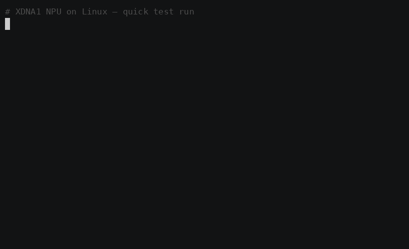

**[🇬🇧 English](README.md) · [🇩🇪 Deutsch](README.de.md) · [🇫🇷 Français](README.fr.md) · [🇰🇷 한국어](README.ko.md) · [🇯🇵 日本語](README.ja.md)**

# npu-runner — persistent XDNA1 NPU caller (IREE runtime C API)



Loads a `.vmfb` **once** and invokes the NPU many times in-process, instead of
spawning `iree-run-module` per call. Measured on a 7840U: **~3.7 ms/invoke vs
~41 ms/invoke** for the subprocess path — ~11× faster, because XRT device-open +
process spawn happen once, not every call. This is what turns "NPU works in a
benchmark" into "NPU usable for always-on KWS / embeddings / CNN / camera / audio."

Two forms, same core:
- **`npu_runner`** — a standalone CLI/benchmark (`npu_runner.cc`).
- **`libnpu.so` + `npu.py`** — a ctypes shared library so **Python** can call the
  NPU fast (used by [`../../examples/npu-camera`](../../examples/npu-camera) and the
  [wake-word](../wake-word) head).

## Build

Requires a built `iree-amd-aie` (see [`../../scripts/build.sh`](../../scripts/build.sh)).
Both build scripts honor `IREE_AMD_AIE_ROOT` (default `~/src/iree-amd-aie`).

```bash
./build.sh        # -> npu_runner (CLI)
./build_lib.sh    # -> libnpu.so   (ctypes)
```

## Run

```bash
# make a test module (i32 128x128 @matmul)
~/src/iree-amd-aie/run_npu_matmul.sh 2 3        # -> /tmp/matmul_npu.vmfb (all 768)

./npu_runner /tmp/matmul_npu.vmfb 1000          # 1000 in-process invokes
python3 npu.py /tmp/matmul_npu.vmfb             # Python ctypes self-test -> 768
```

```python
from npu import NPU
npu = NPU("/tmp/matmul_npu.vmfb")               # i32 128x128 @matmul
out = npu.matmul(a, b)                           # a,b int32[128,128] -> int32[128,128]
npu.close()
```

## What was non-obvious (so you don't re-hit it)

- **g++, never clang** (clang21 ICEs the amdxdna driver TU), like the main build.
- **System allocator macro:** the runtime C API only declares
  `iree_allocator_system()` when `-DIREE_ALLOCATOR_SYSTEM_CTL=iree_allocator_libc_ctl`
  is defined (the build sets it in CMake; a standalone compile must pass it).
- **Proactor pool:** amdxdna device creation dereferences a proactor pool for async
  I/O — without one it segfaults. We create one with
  `iree_async_proactor_pool_create(1, NULL, …)` and set it on
  `iree_hal_device_create_params_t.proactor_pool` (what the runtime's
  `try_create_default_device` does internally).
- **`n_core_cols = 4`** is set explicitly on the device params (5 → ERT state-8
  timeout); a standalone program doesn't parse the `--amdxdna_*` flags.
- **Linking:** the runtime C API is in `libiree_runtime_unified.a`, but the amdxdna
  driver pulls a few HAL-utils archives not bundled in it (deferred_command_buffer,
  queue_emulation, queue_host_call_emulation, resource_set, file_transfer) plus
  async + proactor_pool. If a future checkout adds undefined symbols, find the
  archive with `nm $BLD/**/*.a | grep ' T <symbol>'` and add it to the link group.

## Files

| File | Role |
|---|---|
| `npu_runner.cc` / `build.sh` | standalone CLI + benchmark |
| `libnpu.cc` / `build_lib.sh` | the `libnpu.so` ctypes shared library |
| `npu.py` | Python wrapper around `libnpu.so` |
